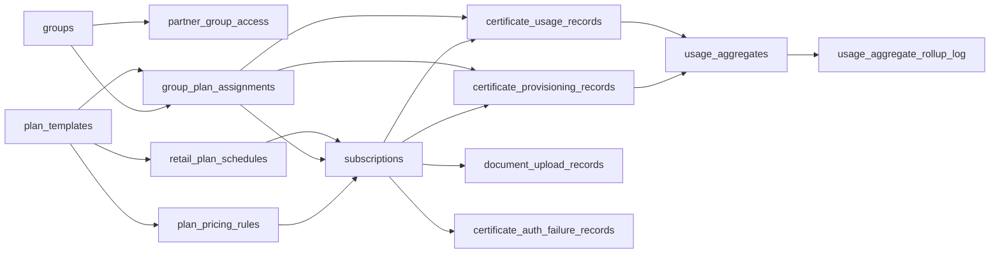
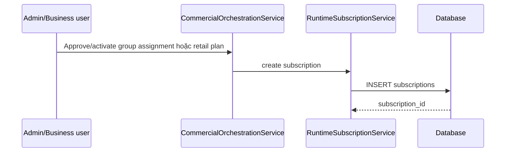
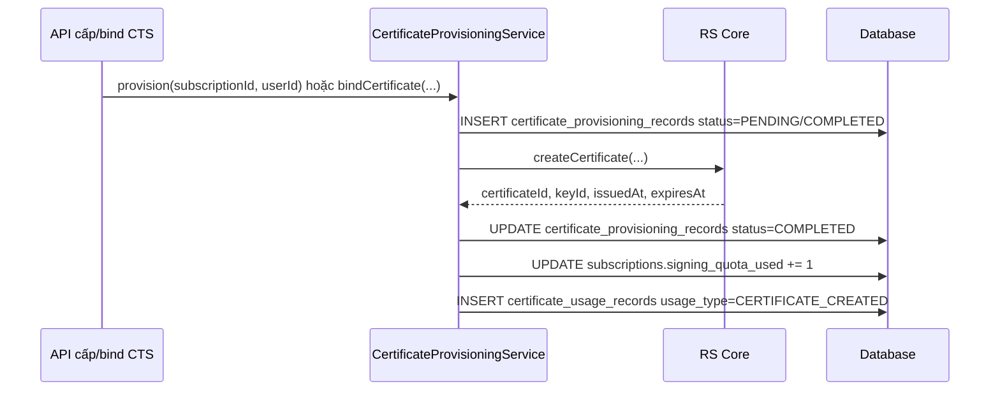
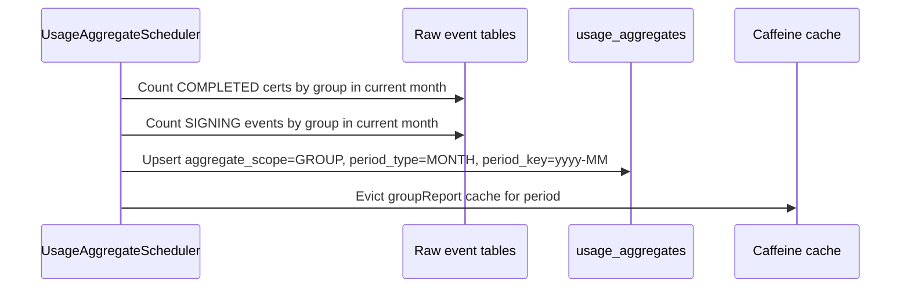
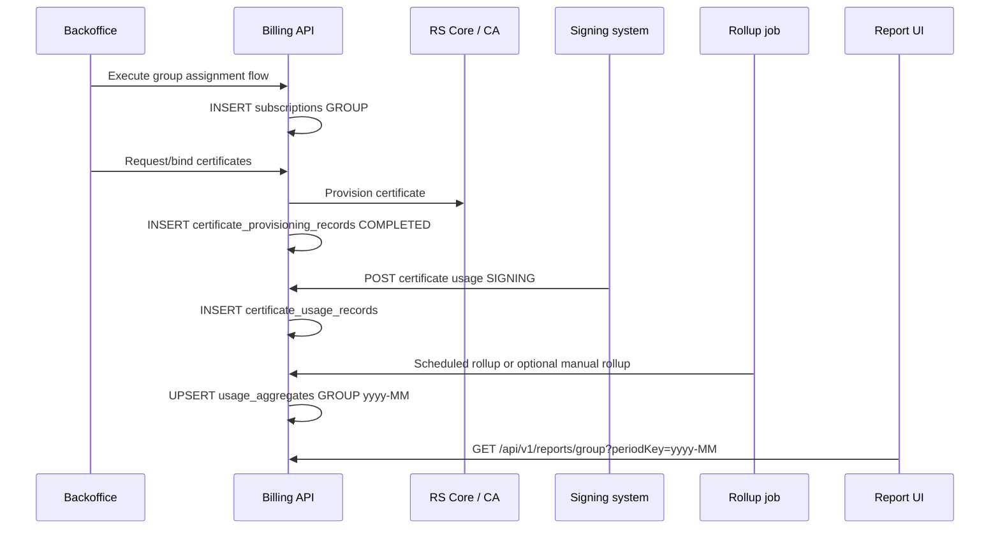
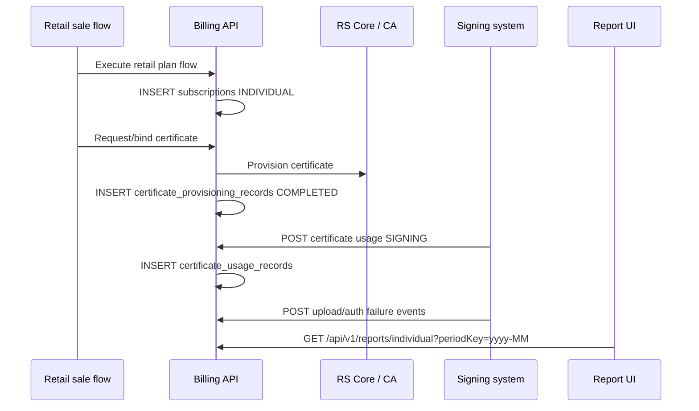

# Báo cáo dashboard: database, luồng dữ liệu và logic nghiệp vụ

Tài liệu này mô tả phần báo cáo đang được dùng bởi:

- `frontend/src/views/reports/index.vue`: dashboard Đại lý (`GROUP`) và switch sang Phổ thông.
- `frontend/src/views/reports/IndividualReport.vue`: dashboard khách hàng Phổ thông (`INDIVIDUAL`).
- `frontend/src/api/reports.ts`: client gọi API báo cáo.
- Backend chính: `ReportsController`, `ReportServiceImpl` và các repository/entity liên quan trong `backend/subscription-provider`.

## 1. API và màn hình sử dụng

| Màn hình | API | Backend method | Quyền |
|---|---|---|---|
| Báo cáo Đại lý | `GET /api/v1/reports/group?periodKey=yyyy-MM` | `ReportServiceImpl.getGroupReport(periodKey)` | `report:group:view`, `report:view:own`, `report:view:subordinates`, `report:view:partner` |
| Danh sách đại lý sắp hết hạn | `GET /api/v1/reports/group/expiring-soon` | `ReportServiceImpl.getExpiringSoon()` | `report:group:view`, `report:view:own`, `report:view:subordinates` |
| Báo cáo Phổ thông | `GET /api/v1/reports/individual?periodKey=yyyy-MM` | `ReportServiceImpl.getIndividualReport(periodKey)` | `report:individual:view`, `report:view:own` |

`periodKey` là chuỗi tháng dạng `yyyy-MM`, ví dụ `2026-03`. Frontend sinh danh sách 12 tháng gần nhất và mặc định chọn tháng hiện tại.

## 2. Sơ đồ quan hệ dữ liệu liên quan



## 3. Các bảng database dùng cho báo cáo

### 3.1 `groups`

Bảng đại lý/tổ chức. Báo cáo Đại lý chỉ lấy các group có `status = 'ACTIVE'`.

Các cột quan trọng:

| Cột | Ý nghĩa trong báo cáo |
|---|---|
| `group_id` | Khóa chính, dùng làm `scope_id` trong `usage_aggregates` với `aggregate_scope = 'GROUP'`. |
| `group_code` | Mã đại lý hiển thị ở popup sắp hết hạn. |
| `group_name` | Tên đại lý, dùng làm nhãn trục/chart và bảng tỷ lệ. |
| `status` | Chỉ `ACTIVE` được tính vào `activePartners`. |
| `owner_user_id` | Dùng để lọc scope theo quyền `group:view:own` hoặc `group:view:subordinates`. |

### 3.2 `partner_group_access`

Bảng cấp quyền cho user partner được xem dữ liệu group.

Các cột quan trọng:

| Cột | Ý nghĩa trong báo cáo |
|---|---|
| `partner_user_id` | User có role `ROLE_PARTNER`. |
| `group_id` | Group được partner xem báo cáo. |
| `revoked_at` | `NULL` nghĩa là quyền còn hiệu lực. |

`DataScopeServiceImpl.resolveVisibleGroupIds()` dùng bảng này khi user là partner, sau đó `getGroupReport()` chỉ giữ các group nằm trong scope.

### 3.3 `group_plan_assignments`

Bảng gán gói cho đại lý. Báo cáo dùng bảng này theo 2 hướng:

- Lấy assignment `ACTIVE` của các group đang hiển thị để đếm chứng thư số theo loại từ `certificate_provisioning_records`.
- Tìm gói sắp hết hạn trong 3 tháng và chưa có gói kế tiếp.

Các cột quan trọng:

| Cột | Ý nghĩa trong báo cáo |
|---|---|
| `group_plan_assignment_id` | Khóa nối sang `subscriptions`, `certificate_provisioning_records`, `certificate_usage_records`. |
| `group_id` | Xác định assignment thuộc đại lý nào. |
| `plan_template_id` | Lấy tên gói từ `plan_templates.plan_name`. |
| `assignment_status` | Báo cáo dùng `ACTIVE`; logic hết hạn kiểm tra thêm `APPROVED`, `ACTIVE` cho gói kế tiếp. |
| `apply_from`, `apply_to` | `apply_to` dùng để cảnh báo gói hết hạn trong khoảng `today` đến `today + 3 months`. |

Logic sắp hết hạn:

```sql
assignment_status = 'ACTIVE'
AND apply_to BETWEEN today AND today + 3 months
AND NOT EXISTS assignment khác cùng group
    có assignment_status IN ('APPROVED', 'ACTIVE')
    AND apply_from > assignment hiện tại.apply_to
```

### 3.4 `plan_templates`

Bảng cấu hình gói. Báo cáo không tính số liệu trực tiếp từ bảng này, nhưng dùng để hiển thị tên gói và xác định gói thuộc phân khúc nào trong các luồng tạo subscription.

Các cột quan trọng:

| Cột | Ý nghĩa |
|---|---|
| `plan_template_id` | Khóa nối từ assignment/subscription. |
| `plan_code`, `plan_name` | Mã/tên gói. `plan_name` hiển thị trong popup gói sắp hết hạn. |
| `customer_segment` | Phân biệt `GROUP` hoặc `INDIVIDUAL` ở luồng cấu hình gói. |
| `allow_bulk_signing`, `allow_api_access` | Được gửi sang RS Core khi cấp chứng thư, không trực tiếp hiển thị trên dashboard. |

### 3.5 `plan_pricing_rules`

Bảng rule giá và loại chủ thể chứng thư. Báo cáo dùng gián tiếp để xác định `cert_type` lúc sinh chứng thư.

Các cột quan trọng:

| Cột | Ý nghĩa |
|---|---|
| `plan_pricing_rule_id` | Khóa nối từ `subscriptions` và `certificate_provisioning_records`. |
| `plan_template_id` | Rule thuộc gói nào. |
| `subject_type` | Map sang loại CTS: `INDIVIDUAL`, `ORGANIZATION`, `INDIVIDUAL_OF_ORG`. |
| `pricing_metric` | Dùng trong nghiệp vụ tính tiền/quota: `CERTIFICATE_COUNT` hoặc `SIGNING_COUNT`. |
| `quota_total` | Sinh `subscriptions.signing_quota_total` nếu request không truyền quota. |

### 3.6 `subscriptions`

Bảng đăng ký sử dụng gói. Đây là bảng trung tâm nối khách hàng, gói và các event chứng thư/ký.

Các cột quan trọng:

| Cột | Ý nghĩa trong báo cáo |
|---|---|
| `subscription_id` | Khóa nối sang `certificate_provisioning_records` và `certificate_usage_records`. |
| `subscriber_type` | `GROUP` hoặc `INDIVIDUAL`. Báo cáo Phổ thông lọc `INDIVIDUAL`. |
| `user_id` | Khách hàng phổ thông; dùng để đếm `activeCustomers` và khách hàng mới theo tuần. |
| `group_id` | Đại lý sở hữu subscription group. |
| `plan_template_id`, `pricing_rule_id` | Gói và rule được mua/áp dụng. |
| `group_plan_assignment_id` | Nối subscription group về assignment. |
| `retail_plan_schedule_id` | Nối subscription individual về lịch bán lẻ. |
| `status` | `ACTIVE` dùng để đếm khách hàng phổ thông đang hoạt động. |
| `created_at` | Báo cáo Phổ thông dùng để đếm khách hàng mới theo tuần trong tháng. |
| `signing_quota_total`, `signing_quota_used` | Quota sử dụng; hiện báo cáo chính lấy lượt ký từ `certificate_usage_records` hoặc `usage_aggregates`, không lấy trực tiếp từ cột này. |

### 3.7 `certificate_provisioning_records`

Bảng raw event cấp/bind chứng thư số. Đây là nguồn chính cho số lượng CTS mới.

Các cột quan trọng:

| Cột | Ý nghĩa trong báo cáo |
|---|---|
| `id` | Khóa chính event cấp CTS. |
| `subscription_id` | Nối về subscription để biết `subscriber_type`. |
| `group_plan_assignment_id` | Nối về assignment/group khi báo cáo Đại lý. |
| `pricing_rule_id` | Rule sinh CTS. |
| `user_id` | Người được cấp CTS. |
| `status` | Chỉ `COMPLETED` được tính là CTS đã tạo. |
| `cert_type` | `1=INDIVIDUAL`, `2=INDIVIDUAL_OF_ORG`, `3=ORGANIZATION`. |
| `certificate_id` | Mã chứng thư, dùng nối với `certificate_usage_records.certificate_id`. |
| `issued_at` | Mốc thời gian lọc theo tháng/tuần báo cáo. |
| `expires_at` | Hạn CTS, hiện chưa dùng trực tiếp trong dashboard báo cáo. |

### 3.8 `certificate_usage_records`

Bảng raw event sử dụng chứng thư. Báo cáo dùng để đếm lượt ký.

Các cột quan trọng:

| Cột | Ý nghĩa trong báo cáo |
|---|---|
| `id` | Khóa chính event sử dụng. |
| `certificate_id` | Nối sang `certificate_provisioning_records.certificate_id` để biết `cert_type`. |
| `user_id` | Người sử dụng chứng thư. |
| `subscription_id` | Nối sang `subscriptions` để lọc `subscriber_type = 'INDIVIDUAL'`. |
| `group_plan_assignment_id` | Nối về group assignment khi rollup dữ liệu Đại lý. |
| `usage_type` | Báo cáo lượt ký chỉ tính `SIGNING`. Event tạo CTS có thể ghi `CERTIFICATE_CREATED` nhưng không tính là signing. |
| `quantity` | Số lượng usage event, mặc định `1`; một số logic settlement cộng theo `quantity`. |
| `used_at` | Mốc thời gian lọc theo tháng/tuần. |

### 3.9 `usage_aggregates`

Bảng tổng hợp theo kỳ, đang là nguồn chính của dashboard Đại lý cho số CTS mới và lượt ký.

Các cột quan trọng:

| Cột | Ý nghĩa trong báo cáo |
|---|---|
| `usage_aggregate_id` | Khóa chính. |
| `aggregate_scope` | Báo cáo Đại lý đọc `GROUP`. Một số logic khác có `GROUP_ASSIGNMENT`. |
| `scope_id` | Với `aggregate_scope = 'GROUP'`, đây là `groups.group_id`. |
| `period_type` | Báo cáo Đại lý đọc `MONTH`. |
| `period_key` | Tháng dạng `yyyy-MM`, ví dụ `2026-03`. |
| `certificates_created` | CTS mới trong kỳ, dùng cho `newCts` và phần trăm tăng trưởng CTS. |
| `signing_used` | Lượt ký trong kỳ, dùng cho `signings`, chart lượt ký và tăng trưởng. |
| `active_certificates`, `expired_certificates`, `revoked_certificates` | Hiện dashboard không hiển thị trực tiếp. |
| `amount_due`, `currency` | Dùng trong settlement, không hiển thị trực tiếp ở dashboard báo cáo. |

Unique key: `(aggregate_scope, scope_id, period_type, period_key)`.

### 3.10 `usage_aggregate_rollup_log`

Bảng log chạy tổng hợp tự động.

Các cột quan trọng:

| Cột | Ý nghĩa |
|---|---|
| `period_key` | Tháng được rollup. |
| `run_at` | Thời điểm chạy. |
| `groups_updated` | Số group được cập nhật vào `usage_aggregates`. |
| `status` | `SUCCESS` hoặc `ERROR`. |
| `error_msg` | Lỗi nếu rollup thất bại. |

### 3.11 `document_upload_records`

Bảng raw event upload tài liệu. Báo cáo Phổ thông dùng bảng này để tính `stats.uploads` và `stats.uploadPct`.

Các cột quan trọng:

| Cột | Ý nghĩa |
|---|---|
| `id` | Khóa chính event upload. |
| `user_id` | User upload tài liệu. |
| `subscription_id` | Nối về `subscriptions`; báo cáo lọc `subscriber_type='INDIVIDUAL'`. |
| `certificate_id` | CTS liên quan nếu có. |
| `document_id` | Mã tài liệu từ hệ thống ký/tài liệu. |
| `upload_status` | `SUCCESS` hoặc `FAILED`. |
| `uploaded_at` | Thời điểm upload, dùng lọc tháng báo cáo. |

### 3.12 `certificate_auth_failure_records`

Bảng raw event xác thực thất bại khi ký. Báo cáo Phổ thông dùng bảng này để tính chart lỗi `PIN`, `OTP`, `MOC`.

Các cột quan trọng:

| Cột | Ý nghĩa |
|---|---|
| `id` | Khóa chính event lỗi. |
| `user_id` | User gặp lỗi xác thực. |
| `subscription_id` | Nối về `subscriptions`; báo cáo lọc `subscriber_type='INDIVIDUAL'`. |
| `certificate_id` | CTS liên quan nếu có. |
| `failure_type` | `PIN`, `OTP`, hoặc `MOC`. |
| `reason_code` | Mã lỗi chi tiết từ hệ thống ký/xác thực. |
| `failed_at` | Thời điểm lỗi, dùng lọc tháng báo cáo. |

## 4. Luồng dữ liệu sinh ra báo cáo

### 4.1 Luồng phát sinh subscription



Đại lý:

1. Gói đại lý được cấu hình trong `plan_templates` và `plan_pricing_rules`.
2. Gói được gán cho đại lý qua `group_plan_assignments`.
3. Khi assignment được `ACTIVE`, `CommercialOrchestrationService.executeGroupAssignmentFlow()` có thể phát hành `subscriptions` với `subscriber_type = 'GROUP'`, `group_id`, `group_plan_assignment_id`.

Phổ thông:

1. Gói phổ thông được cấu hình trong `plan_templates`, `plan_pricing_rules`, và lịch bán trong `retail_plan_schedules`.
2. Khi retail plan được approve/activate và user mua gói, `CommercialOrchestrationService.executeRetailPlanFlow()` phát hành `subscriptions` với `subscriber_type = 'INDIVIDUAL'`, `user_id`, `retail_plan_schedule_id`.

### 4.2 Luồng cấp chứng thư số



Logic loại CTS:

| `plan_pricing_rules.subject_type` | `certificate_provisioning_records.cert_type` |
|---|---|
| `INDIVIDUAL` | `1` / `INDIVIDUAL` |
| `INDIVIDUAL_OF_ORG` | `2` / `INDIVIDUAL_OF_ORGANIZATION` |
| `ORGANIZATION` | `3` / `ORGANIZATION` |

Chỉ bản ghi `certificate_provisioning_records.status = 'COMPLETED'` và `issued_at` nằm trong tháng báo cáo mới được tính vào số CTS mới.

### 4.3 Luồng ghi lượt ký

Lượt ký được lưu trong `certificate_usage_records` với:

- `usage_type = 'SIGNING'`
- `used_at` là thời điểm ký
- `certificate_id` nối về chứng thư để biết loại CTS
- `subscription_id` nối về subscription để biết khách hàng phổ thông hay đại lý
- `group_plan_assignment_id` nối về assignment/group để rollup theo đại lý

Dashboard Phổ thông đọc trực tiếp bảng raw event này theo tuần trong tháng. Dashboard Đại lý đọc số lượt ký đã rollup trong `usage_aggregates`.

### 4.4 Luồng ghi upload tài liệu và lỗi xác thực

Upload tài liệu được lưu trong `document_upload_records` với:

- `upload_status = 'SUCCESS'` hoặc `FAILED`
- `uploaded_at` là thời điểm upload
- `subscription_id` nối về subscription để báo cáo lọc khách hàng Phổ thông
- `certificate_id` và `document_id` dùng để đối soát với hệ thống ký/tài liệu

Lỗi xác thực khi ký được lưu trong `certificate_auth_failure_records` với:

- `failure_type = 'PIN'`, `OTP`, hoặc `MOC`
- `failed_at` là thời điểm lỗi
- `reason_code` là mã lỗi chi tiết do hệ thống ký/xác thực gửi về
- `subscription_id` nối về subscription để báo cáo lọc khách hàng Phổ thông

Dashboard Phổ thông đọc trực tiếp hai bảng này theo tháng. Sau mỗi lần ghi event qua API, backend clear cache `individualReport` để request kế tiếp lấy số liệu mới.

### 4.5 Luồng rollup dữ liệu Đại lý



`UsageAggregateSchedulerServiceImpl.rollupCurrentMonth()` chạy hằng ngày lúc `01:00 AM` và tổng hợp tháng hiện tại:

1. Đếm CTS theo group:
   - Từ `certificate_provisioning_records`
   - Join `group_plan_assignments`
   - Điều kiện `status = 'COMPLETED'`
   - Điều kiện `issued_at` trong tháng
2. Đếm lượt ký theo group:
   - Từ `certificate_usage_records`
   - Join `group_plan_assignments`
   - Điều kiện `usage_type = 'SIGNING'`
   - Điều kiện `used_at` trong tháng
3. Upsert vào `usage_aggregates` với:
   - `aggregate_scope = 'GROUP'`
   - `scope_id = group_id`
   - `period_type = 'MONTH'`
   - `period_key = yyyy-MM`
   - `certificates_created = số CTS`
   - `signing_used = số lượt ký`
   - `active_certificates = số CTS`
4. Ghi log vào `usage_aggregate_rollup_log`.
5. Xóa cache `groupReport` cho kỳ vừa rollup.

Ngoài scheduler, `CommercialOrchestrationService.generateSettlement()` cũng có hàm `upsertGroupAggregate()`, nhưng hàm này dùng `period_key` dạng range `yyyyMMdd-yyyyMMdd`. Dashboard hiện đọc `period_key = yyyy-MM`, nên dữ liệu dashboard Đại lý chủ yếu phụ thuộc scheduler monthly rollup hoặc dữ liệu seed đúng dạng `yyyy-MM`.

## 5. Logic API báo cáo Đại lý

Backend method: `ReportServiceImpl.getGroupReport(periodKey)`.

### 5.1 Bước xử lý

1. Lấy scope group theo user hiện tại qua `DataScopeService.resolveVisibleGroupIds()`.
2. Lấy danh sách `groups.status = 'ACTIVE'`, sau đó lọc theo scope nếu có.
3. Lấy `usage_aggregates` tháng hiện tại và tháng trước:
   - `aggregate_scope = 'GROUP'`
   - `period_type = 'MONTH'`
   - `period_key = periodKey` hoặc tháng trước.
4. Lấy tất cả `group_plan_assignments.assignment_status = 'ACTIVE'` của các group visible.
5. Đếm CTS `COMPLETED` theo `group_plan_assignment_id` và `cert_type` trong tháng từ `certificate_provisioning_records`.
6. Lấy danh sách assignment sắp hết hạn trong 3 tháng và không có gói kế tiếp.
7. Tổng hợp in-memory thành response cho frontend.

### 5.2 Công thức output

| Response field | Công thức/nguồn |
|---|---|
| `stats.activePartners` | Số `groups` active trong scope. |
| `stats.newCts` | Tổng `usage_aggregates.certificates_created` của tháng hiện tại trong các group active. |
| `stats.signings` | Tổng `usage_aggregates.signing_used` của tháng hiện tại trong các group active. |
| `stats.expiringSoon` | Số group distinct có assignment active hết hạn trong 3 tháng và chưa có gói kế tiếp. |
| `stats.newCtsPct` | `(newCts tháng này - newCts tháng trước) / newCts tháng trước * 100`, nếu tháng trước bằng 0 thì trả `0`. |
| `stats.signingsPct` | `(signings tháng này - signings tháng trước) / signings tháng trước * 100`, nếu tháng trước bằng 0 thì trả `0`. |
| `agencies` | `group_name` của các group active trong scope. |
| `certData.individual` | Số CTS `cert_type = INDIVIDUAL` từ `certificate_provisioning_records` theo từng group. |
| `certData.organization` | Số CTS `cert_type = ORGANIZATION` theo từng group. |
| `certData.individualOfOrg` | Số CTS `cert_type = INDIVIDUAL_OF_ORGANIZATION` theo từng group. |
| `signingData` | `usage_aggregates.signing_used` theo từng group. |
| `growthData.current` | Lượt ký tháng hiện tại của group. |
| `growthData.prev` | Lượt ký tháng trước của group. |
| `growthData.growth` | `(current - prev) / prev * 100`, nếu `prev = 0` thì `0`. |
| `ratioData.*` | `số lượt ký của loại CTS / số CTS của loại đó` theo từng group, làm tròn 1 chữ số thập phân. |
| `expiringRows` | `group_code`, `group_name`, `plan_name`, `apply_to` của assignment sắp hết hạn. |
| `lastUpdated` | Thời điểm backend trả response, không phải thời điểm rollup. |

`ratioData` lấy số CTS theo loại từ `certificate_provisioning_records` và số lượt ký theo loại từ `certificate_usage_records` join qua `certificate_id`. Nếu một loại CTS không có chứng thư trong tháng thì tỷ lệ của loại đó là `0`.

## 6. Logic API báo cáo Phổ thông

Backend method: `ReportServiceImpl.getIndividualReport(periodKey)`.

### 6.1 Bước xử lý

1. Parse `periodKey` thành khoảng thời gian `[yyyy-MM-01 00:00, tháng sau)`.
2. Đếm khách hàng phổ thông active:
   - `subscriptions.subscriber_type = 'INDIVIDUAL'`
   - `subscriptions.status = 'ACTIVE'`
   - `user_id IS NOT NULL`
   - `COUNT(DISTINCT user_id)`
3. Đếm CTS theo tuần và loại CTS:
   - Từ `certificate_provisioning_records`
   - Join `subscriptions`
   - Điều kiện `subscriptions.subscriber_type = 'INDIVIDUAL'`
   - Điều kiện `certificate_provisioning_records.status = 'COMPLETED'`
   - Điều kiện `issued_at` trong tháng
4. Đếm lượt ký theo tuần và loại CTS:
   - Từ `certificate_usage_records`
   - Join `certificate_provisioning_records` qua `certificate_id`
   - Join `subscriptions`
   - Điều kiện `subscriptions.subscriber_type = 'INDIVIDUAL'`
   - Điều kiện `certificate_usage_records.usage_type = 'SIGNING'`
   - Điều kiện `used_at` trong tháng
5. Đếm khách hàng mới theo tuần:
   - Từ `subscriptions`
   - `subscriber_type = 'INDIVIDUAL'`
   - `created_at` trong tháng
   - `COUNT(DISTINCT user_id)`
6. Trả response với 4 tuần cố định: `Tuần 1` đến `Tuần 4`.

### 6.2 Công thức output

| Response field | Công thức/nguồn |
|---|---|
| `stats.activeCustomers` | `COUNT(DISTINCT subscriptions.user_id)` với subscription individual active. |
| `stats.newCts` | Tổng CTS completed trong tháng, gồm 3 loại CTS. |
| `stats.signings` | Tổng usage `SIGNING` trong tháng, gồm 3 loại CTS. |
| `stats.uploads` | Tổng upload thành công từ `document_upload_records` trong tháng. |
| `stats.uploadPct` | `successful uploads / total upload attempts * 100`, nếu chưa có upload attempt thì `0`. |
| `weeks` | `["Tuần 1", "Tuần 2", "Tuần 3", "Tuần 4"]`. |
| `newCustChart` | Số user mới theo tuần từ `subscriptions.created_at`. |
| `ctsChart.individual` | CTS `cert_type = 1` theo tuần. |
| `ctsChart.individualOfOrg` | CTS `cert_type = 2` theo tuần. |
| `ctsChart.organization` | CTS `cert_type = 3` theo tuần. |
| `signingChart.*` | Lượt ký `SIGNING` theo tuần, phân loại theo `certificate_provisioning_records.cert_type`. |
| `failureChart.pin/otp/moc` | Tỷ lệ lỗi xác thực theo tuần từ `certificate_auth_failure_records`, mẫu số là `signing success + auth failures` của tuần đó. |

Tuần được tính bằng MySQL:

```sql
WEEK(event_time, 1) - WEEK(DATE_FORMAT(event_time, '%Y-%m-01'), 1) + 1
```

Backend clamp về 1 đến 4. Vì vậy các ngày thuộc tuần thứ 5 của tháng sẽ được gộp vào `Tuần 4`.

## 7. Cache và độ tươi dữ liệu

| API | Cache | Key |
|---|---|---|
| Group report | `groupReport` | `periodKey + ':' + authentication.name` |
| Group expiring soon | `groupReport` | `'expiring'` |
| Individual report | `individualReport` | `periodKey` |

Điểm cần chú ý:

- Dashboard Đại lý đọc `usage_aggregates`, nên phụ thuộc vào rollup. Nếu raw event mới phát sinh nhưng scheduler chưa chạy, số liệu `newCts` và `signings` theo group có thể chưa cập nhật.
- Dashboard Đại lý vẫn đọc `certificate_provisioning_records` trực tiếp để vẽ breakdown CTS theo loại, nên có thể mới hơn `usage_aggregates` nếu rollup chưa chạy.
- Dashboard Phổ thông đọc raw event trực tiếp, nên thường phản ánh dữ liệu mới hơn.
- `lastUpdated` trong group response là thời gian request, không chứng minh dữ liệu trong `usage_aggregates` vừa được rollup.

## 8. Mapping từ frontend sang dữ liệu backend

### Báo cáo Đại lý

| Widget frontend | Response field | Bảng nguồn chính |
|---|---|---|
| SL đại lý đang hoạt động | `stats.activePartners` | `groups` |
| SL CTS mới trong tháng | `stats.newCts`, `stats.newCtsPct` | `usage_aggregates` |
| SL lượt ký trong tháng | `stats.signings`, `stats.signingsPct` | `usage_aggregates` |
| Đại lý có gói hiệu lực dưới 3 tháng | `stats.expiringSoon`, `expiringRows` | `group_plan_assignments`, `groups`, `plan_templates` |
| Chart SL chứng thư số được tạo | `certData.*` theo `agencies` | `certificate_provisioning_records`, `group_plan_assignments` |
| Chart SL lượt ký theo tháng | `signingData` theo `agencies` | `usage_aggregates` |
| Bảng tỷ lệ lượt ký/1 CTS | `ratioData` | `certificate_usage_records`, `certificate_provisioning_records` |
| Chart tăng trưởng lượt ký | `growthData` | `usage_aggregates` tháng hiện tại và tháng trước |

### Báo cáo Phổ thông

| Widget frontend | Response field | Bảng nguồn chính |
|---|---|---|
| SL khách hàng có CTS đang hoạt động | `stats.activeCustomers` | `subscriptions` |
| SL CTS mới trong tháng | `stats.newCts`, `ctsChart.*` | `certificate_provisioning_records`, `subscriptions` |
| SL lượt ký trong tháng | `stats.signings`, `signingChart.*` | `certificate_usage_records`, `certificate_provisioning_records`, `subscriptions` |
| Tài liệu đã upload | `stats.uploads`, `stats.uploadPct` | `document_upload_records`, `subscriptions` |
| SL khách hàng mới trong tháng | `newCustChart` | `subscriptions.created_at` |
| Tỷ lệ xác thực thất bại | `failureChart.*` | `certificate_auth_failure_records`, `subscriptions` |

## 9. Các điểm cần lưu ý khi kiểm tra dữ liệu

1. Nếu báo cáo Đại lý không có số `newCts` hoặc `signings`, kiểm tra `usage_aggregates` có dòng `aggregate_scope='GROUP'`, `period_type='MONTH'`, `period_key='yyyy-MM'`, `scope_id=group_id` hay chưa.
2. Nếu chart CTS theo loại của Đại lý có dữ liệu nhưng card `newCts` bằng 0, khả năng cao raw `certificate_provisioning_records` đã có nhưng `usage_aggregates` chưa rollup.
3. Nếu báo cáo Phổ thông thiếu dữ liệu theo tuần, kiểm tra `subscriptions.subscriber_type='INDIVIDUAL'` và event time `issued_at`/`used_at` có nằm trong tháng `periodKey`.
4. `failureChart` và `uploads` của báo cáo Phổ thông chỉ có dữ liệu khi hệ thống ký/xác thực gọi API ghi event tương ứng.
5. API Đại lý có scope theo user; cùng `periodKey` nhưng user khác nhau có thể thấy số liệu khác nhau.
6. Danh sách gói sắp hết hạn dùng `LocalDate.now()`, không phụ thuộc `periodKey` đã chọn trên frontend.

## 10. Các API cần cung cấp/gọi để dữ liệu thống kê hoàn thiện

Phần dashboard không nên được bơm dữ liệu trực tiếp vào các bảng report bằng tay trong vận hành thật. Dữ liệu nên đi qua các API nghiệp vụ, sau đó raw event được rollup sang `usage_aggregates`.

Có 4 nhóm bên tham gia:

| Bên tham gia | Trách nhiệm dữ liệu | Bảng bị ảnh hưởng |
|---|---|---|
| Hệ thống bán/gán gói | Tạo subscription cho Đại lý hoặc Phổ thông. | `subscriptions`, gián tiếp qua `group_plan_assignments`, `retail_plan_schedules` |
| Hệ thống cấp CTS / RS Core | Cấp hoặc bind CTS thành công/thất bại. | `certificate_provisioning_records`, `certificate_usage_records` với `CERTIFICATE_CREATED` |
| Hệ thống ký/xác thực tài liệu | Ghi event ký, event upload, event xác thực thất bại. | `certificate_usage_records`, `document_upload_records`, `certificate_auth_failure_records` |
| Job tổng hợp/report | Tổng hợp raw event sang aggregate tháng. | `usage_aggregates`, `usage_aggregate_rollup_log` |

### 10.1 API tạo subscription

Các API hiện có:

| Mục đích | API | Ai gọi | Kết quả chính |
|---|---|---|---|
| Phát hành subscription từ assignment Đại lý | `POST /api/v1/commercial-flows/group-assignments/{assignmentId}/execute` | Admin/Backoffice | Tạo/cập nhật `group_plan_assignments`, tạo `subscriptions.subscriber_type='GROUP'` |
| Phát hành subscription từ lịch bán lẻ | `POST /api/v1/commercial-flows/retail-plan-schedules/{scheduleId}/execute` | Admin/Backoffice hoặc luồng mua gói | Tạo `subscriptions.subscriber_type='INDIVIDUAL'` |
| Tạo subscription trực tiếp | `POST /api/v1/runtime-subscriptions` | Internal/Admin | Tạo `subscriptions` trực tiếp |
| Cập nhật trạng thái subscription | `PATCH /api/v1/runtime-subscriptions/{id}/status` | Internal/Admin | Cập nhật `subscriptions.status` |

Payload chính cho `POST /api/v1/commercial-flows/group-assignments/{assignmentId}/execute`:

```json
{
  "actor": "admin@example.com",
  "approveNow": true,
  "activateNow": true,
  "issueSubscription": true,
  "pricingRuleId": 11,
  "subscriptionStatus": "ACTIVE",
  "startDate": "2026-03-01",
  "endDate": "2027-03-01",
  "signingQuotaTotal": 1000,
  "paymentReference": "PAY-GROUP-001"
}
```

Payload chính cho `POST /api/v1/commercial-flows/retail-plan-schedules/{scheduleId}/execute`:

```json
{
  "actor": "system",
  "userId": 10001,
  "approveNow": true,
  "activateNow": true,
  "issueSubscription": true,
  "pricingRuleId": 1,
  "subscriptionStatus": "ACTIVE",
  "startDate": "2026-03-01",
  "endDate": "2027-03-01",
  "signingQuotaTotal": 100,
  "paymentReference": "PAY-IND-001"
}
```

Khi các API này chạy đúng, báo cáo Phổ thông có cơ sở để đếm:

- `activeCustomers` từ `subscriptions.status='ACTIVE'`.
- `newCustChart` từ `subscriptions.created_at`.

Báo cáo Đại lý có cơ sở nối group với assignment/subscription để ghi CTS và lượt ký về đúng đại lý.

### 10.2 API cấp hoặc bind chứng thư số

Các API hiện có:

| Mục đích | API | Ai gọi | Kết quả chính |
|---|---|---|---|
| User yêu cầu cấp CTS cho subscription | `POST /api/v1/certificates/request?subscriptionId={id}` | Frontend/User service | Gọi RS Core, tạo/cập nhật `certificate_provisioning_records` |
| Admin bind CTS đã có vào subscription | `POST /api/v1/subscriptions/{subscriptionId}/certificate/bind?userId={id}` | Admin/Import tool | Tạo `certificate_provisioning_records.status='COMPLETED'` |
| Retry cấp CTS lỗi | `POST /api/v1/admin/certificates/{recordId}/retry` | Admin/Job vận hành | Cập nhật trạng thái provisioning |

Payload bind CTS:

```json
{
  "certificateId": "CERT-EXT-001",
  "keyId": "KEY-EXT-001",
  "certType": 1,
  "issuedAt": "2026-03-01T09:00:00",
  "expiresAt": "2027-03-01T09:00:00"
}
```

Các API này làm đầy bảng `certificate_provisioning_records`. Đây là nguồn cho:

- CTS mới của báo cáo Phổ thông.
- Breakdown CTS theo loại của báo cáo Đại lý.
- Rollup `certificates_created` vào `usage_aggregates`.

Điều kiện để dashboard tính CTS:

- `status = 'COMPLETED'`
- `issued_at` nằm trong tháng `periodKey`
- `cert_type` đúng mapping: `1=INDIVIDUAL`, `2=INDIVIDUAL_OF_ORG`, `3=ORGANIZATION`
- Với Đại lý, cần có `group_plan_assignment_id`.
- Với Phổ thông, `subscription_id` phải trỏ tới subscription có `subscriber_type='INDIVIDUAL'`.

### 10.3 API ghi lượt ký

Backend có bảng `certificate_usage_records` và các API đọc lịch sử usage:

| Mục đích | API hiện có | Ghi chú |
|---|---|---|
| Xem lịch sử usage theo cert | `GET /api/v1/admin/certificates/{certId}/usage-history` | Chỉ đọc |
| Xem daily usage | `GET /api/v1/admin/certificates/{certId}/usage-daily` | Chỉ đọc |

Backend cung cấp API để bên ký tài liệu gọi vào nhằm ghi event `SIGNING`:

```http
POST /api/v1/certificate-usages
```

Quyền: `report:event:create` hoặc `plan:update`.

Payload:

```json
{
  "certificateId": "CERT-EXT-001",
  "userId": 10001,
  "subscriptionId": 15,
  "groupPlanAssignmentId": null,
  "usageType": "SIGNING",
  "quantity": 1,
  "usedAt": "2026-03-05T10:30:00"
}
```

Luồng xử lý:

1. Validate `certificateId` tồn tại trong `certificate_provisioning_records` và `status='COMPLETED'`.
2. Nếu caller không truyền `subscriptionId`, backend tra từ `certificate_provisioning_records.subscription_id`.
3. Nếu caller không truyền `groupPlanAssignmentId`, backend tra từ `certificate_provisioning_records.group_plan_assignment_id`.
4. Insert `certificate_usage_records` với `usage_type='SIGNING'`, `quantity`, `used_at`.
5. Nếu `usage_type = 'SIGNING'`, tăng `certificate_provisioning_records.usage_count` và `subscriptions.signing_quota_used`.
6. Clear cache `individualReport`.
7. Trả ID event để đối soát.

Nếu API này không được gọi, số liệu lượt ký chỉ có thể vào DB bằng job/import hoặc code nội bộ khác. Khi đó báo cáo Phổ thông thiếu `signingChart` và rollup Đại lý thiếu `signing_used`.

### 10.4 API upload tài liệu và xác thực thất bại

Frontend `IndividualReport.vue` đang hiển thị:

- `stats.uploads`
- `stats.uploadPct`
- `failureChart.pin`
- `failureChart.otp`
- `failureChart.moc`

Backend đã bổ sung bảng raw event và API để ghi các dữ liệu này.

API upload tài liệu:

```http
POST /api/v1/report-events/document-upload
```

Quyền: `report:event:create` hoặc `plan:update`.

Payload:

```json
{
  "userId": 10001,
  "subscriptionId": 15,
  "certificateId": "CERT-EXT-001",
  "documentId": "DOC-0001",
  "uploadStatus": "SUCCESS",
  "uploadedAt": "2026-03-05T09:10:00"
}
```

Bảng nguồn:

```sql
document_upload_records(
  id,
  user_id,
  subscription_id,
  certificate_id,
  document_id,
  upload_status,
  uploaded_at,
  created_at
)
```

API xác thực thất bại:

```http
POST /api/v1/report-events/auth-failure
```

Quyền: `report:event:create` hoặc `plan:update`.

Payload:

```json
{
  "userId": 10001,
  "subscriptionId": 15,
  "certificateId": "CERT-EXT-001",
  "failureType": "OTP",
  "failedAt": "2026-03-05T10:00:00",
  "reasonCode": "OTP_EXPIRED"
}
```

Bảng nguồn:

```sql
certificate_auth_failure_records(
  id,
  user_id,
  subscription_id,
  certificate_id,
  failure_type,
  reason_code,
  failed_at,
  created_at
)
```

`ReportServiceImpl.getIndividualReport()` hiện đọc hai nguồn này như sau:

- `stats.uploads`: đếm document upload thành công trong tháng.
- `stats.uploadPct`: tỷ lệ upload thành công/tổng upload attempt.
- `failureChart`: group theo tuần và `failure_type IN ('PIN','OTP','MOC')`.

### 10.5 API rollup aggregate

Các cách hiện có để làm đầy `usage_aggregates`:

| Cách | API/job | Ghi chú |
|---|---|---|
| Tự động | `UsageAggregateSchedulerServiceImpl.rollupCurrentMonth()` | Chạy hằng ngày 01:00, tổng hợp tháng hiện tại từ raw event. |
| Upsert thủ công | `POST /api/v1/usage-aggregates` | Ghi trực tiếp aggregate, cần quyền `report:view`. |
| Settlement | `POST /api/v1/commercial-flows/groups/{groupId}/settlement` | Có upsert aggregate nhưng `period_key` dạng range `yyyyMMdd-yyyyMMdd`, không khớp dashboard `yyyy-MM`. |

Payload upsert aggregate:

```json
{
  "aggregateScope": "GROUP",
  "scopeId": 1,
  "periodType": "MONTH",
  "periodKey": "2026-03",
  "certificatesCreated": 12,
  "signingUsed": 350,
  "activeCertificates": 12,
  "expiredCertificates": 0,
  "revokedCertificates": 0,
  "amountDue": 1500000,
  "currency": "VND"
}
```

Khuyến nghị vận hành:

1. Raw event vẫn phải ghi đầy đủ vào `certificate_provisioning_records` và `certificate_usage_records`.
2. `POST /api/v1/usage-aggregates` chỉ nên dùng cho backfill/manual fix.
3. Có thể trigger rollup thủ công theo tháng khi cần backfill/import lại dữ liệu:

```http
POST /api/v1/admin/usage-aggregates/rollup?periodKey=2026-03
```

Endpoint này gọi `UsageAggregateSchedulerServiceImpl.rollupPeriod(periodKey)` và trả `periodKey`, `groupsUpdated`.

## 11. Thứ tự gọi API để dashboard có đủ dữ liệu

### 11.1 Luồng Đại lý



Thứ tự chi tiết:

1. Tạo/activate assignment cho group.
2. Gọi `POST /api/v1/commercial-flows/group-assignments/{assignmentId}/execute` để sinh subscription group.
3. Khi cấp CTS, gọi `POST /api/v1/certificates/request?subscriptionId=...` hoặc bind thủ công.
4. Khi người dùng ký, hệ thống ký gọi `POST /api/v1/certificate-usages` để ghi usage event `SIGNING`.
5. Chạy scheduler để cập nhật `usage_aggregates`; nếu đã bổ sung API admin rollup thủ công thì có thể gọi lại theo `periodKey`.
6. Frontend gọi `GET /api/v1/reports/group?periodKey=yyyy-MM`.

Nếu bỏ bước 5, card tổng CTS/lượt ký Đại lý có thể không khớp raw event.

### 11.2 Luồng Phổ thông



Thứ tự chi tiết:

1. Gọi `POST /api/v1/commercial-flows/retail-plan-schedules/{scheduleId}/execute` để sinh subscription individual.
2. Gọi API cấp/bind CTS để tạo `certificate_provisioning_records`.
3. Gọi API ghi usage `SIGNING` sau mỗi lần ký thành công.
4. Hệ thống ký/tài liệu gọi `POST /api/v1/report-events/document-upload` và `POST /api/v1/report-events/auth-failure` để ghi upload/lỗi xác thực.
5. Frontend gọi `GET /api/v1/reports/individual?periodKey=yyyy-MM`.

Báo cáo Phổ thông hiện đọc raw event trực tiếp, nên không bắt buộc phải rollup `usage_aggregates`.

## 12. Trạng thái API tích hợp báo cáo

| Trạng thái | API | Lý do |
|---|---|---|
| Đã bổ sung | `POST /api/v1/certificate-usages` | Ghi `certificate_usage_records` cho lượt ký thật. |
| Đã bổ sung | `POST /api/v1/admin/usage-aggregates/rollup?periodKey=yyyy-MM` | Trigger lại rollup sau import/backfill. |
| Đã bổ sung | `POST /api/v1/report-events/document-upload` | Làm thật `stats.uploads` và `stats.uploadPct`. |
| Đã bổ sung | `POST /api/v1/report-events/auth-failure` | Làm thật `failureChart.pin/otp/moc`. |
| Đã bổ sung | `GET /api/v1/admin/usage-aggregates/health?periodKey=yyyy-MM` | Trả số raw cert/signing group, aggregate và thời điểm rollup để phát hiện lệch. |

Khuyến nghị ưu tiên triển khai:

1. Ưu tiên để các hệ thống ngoài ghi raw event qua API event, không ghi trực tiếp vào `usage_aggregates`.
2. Chỉ dùng `POST /api/v1/usage-aggregates` cho backfill/manual fix nội bộ.
3. Sau import dữ liệu quá khứ, gọi rollup thủ công rồi kiểm tra health để xác nhận raw event và aggregate đã khớp.
